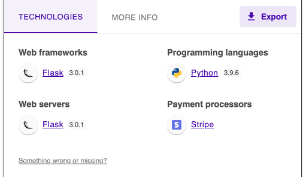
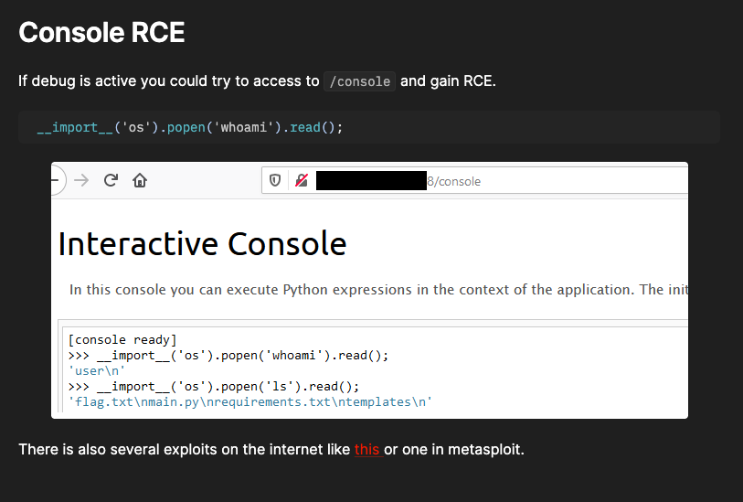
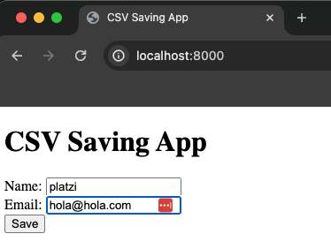
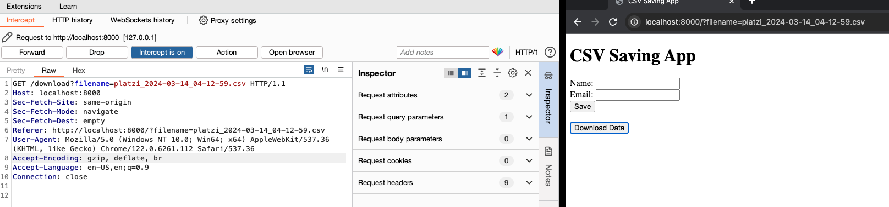
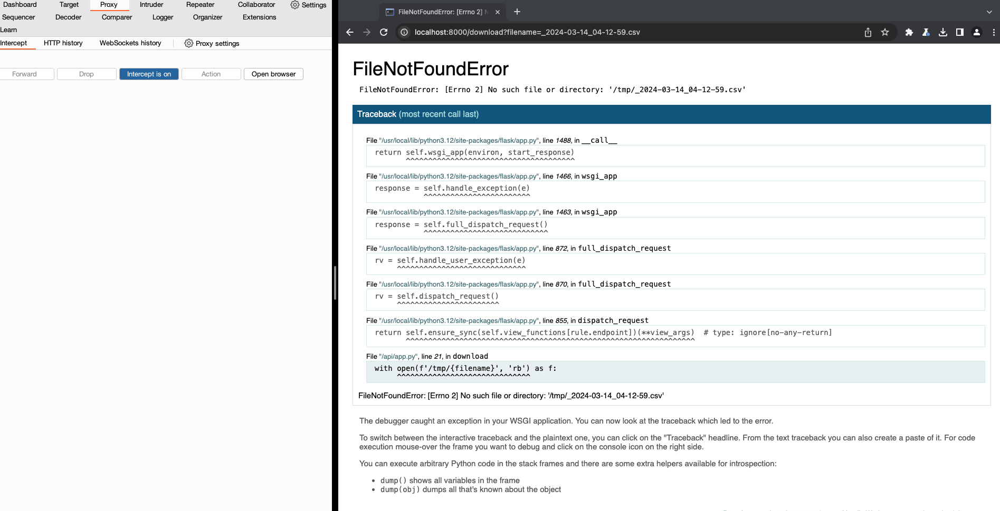
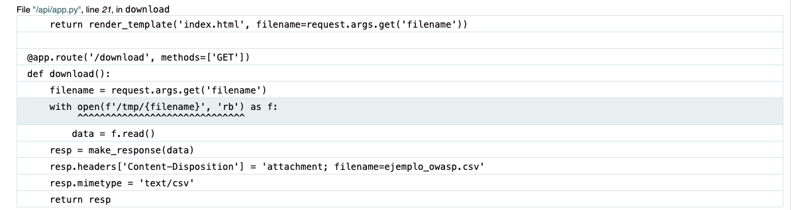
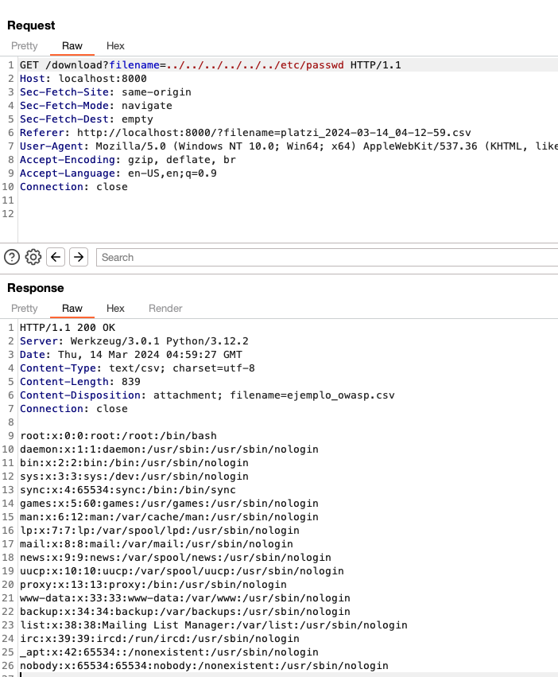
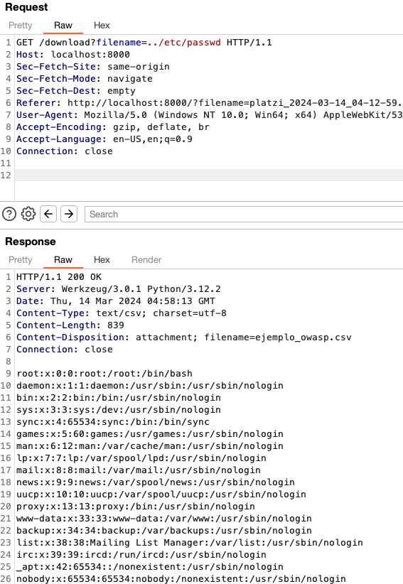
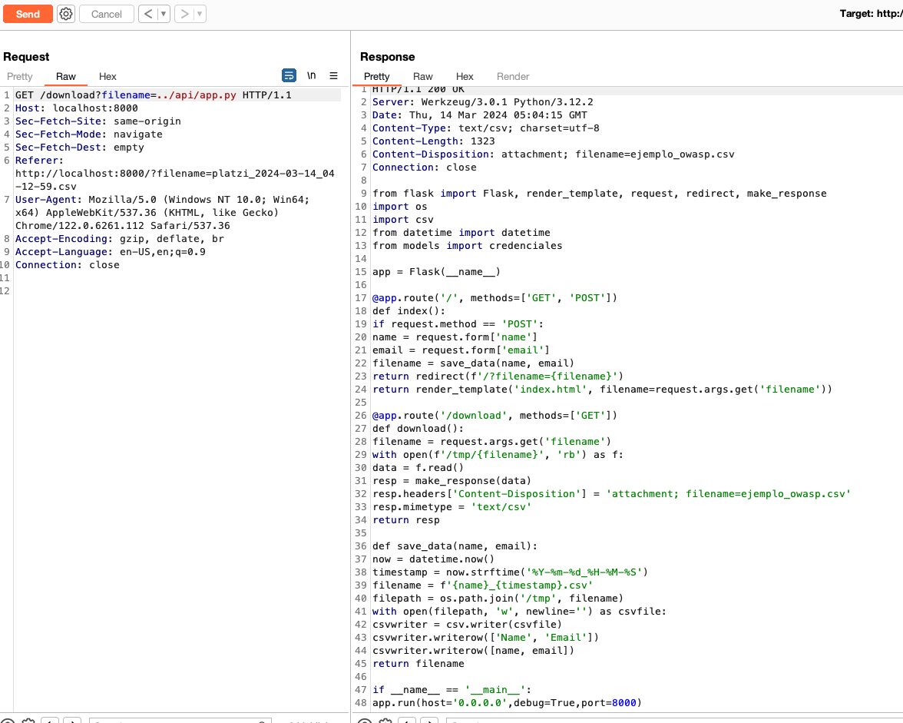
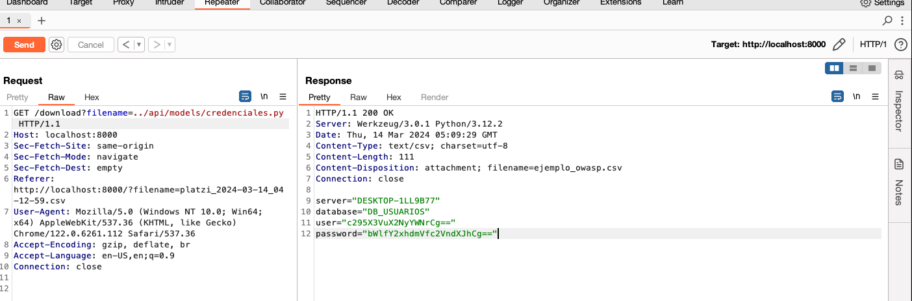

# Aplicacion Vulnerable - A04 Insecure Design

En este momento, estamos frente a una aplicacion que recibe un usuario y un correo electronico y luego nos genera un archivo CSV.

si usamos **wappalyzer**, nos daremos cuenta a que nos estamos enfrentando:



Vemos que es una aplicacion en **Flask 3.0.1** con **Python 3.9.6**

Ya, esta informacion en si es de vital importancia para ajustar nuestros vectores de ataque. Con esto, ya podemos utilizar herramientas como searchsploit o hacktricks para revisar que se puede encontrar con respecto al framework o lenguaje en si:

- https://book.hacktricks.xyz/network-services-pentesting/pentesting-web/werkzeug



Ahora vamos a nuestra app.



Ponemos los datos requeridos y le damos a guardar. Cuando hacemos esto, nos aparece un nuevo boton con el que podemos descargar un archivo y ya nos aparece una URL diferente, con el nombre del archivo que vamos a descargar. Pasemos esta peticion del boton download a burpsuite y veamos que tiene

```html
http://localhost:8000/?filename=platzi_2024-03-14_03-59-21.csv
```



Lo que vemos, es que llama a un archivo que tiene en el sistema para descargarlo. Pero, que pasaria si modificamos el nombre de este archivo? 



Nos muestra el debug, esto solo se muestra en flask cuando el debug esta en true. 

```bash
FileNotFoundError: [Errno 2] No such file or directory: '/tmp/_2024-03-14_04-12-59.csv'
```

El error es claro, no encontro el archivo o directorio. Pero, el debug sigue y nos muestra lo siguiente:



Cuando el debug, esta activado, nos muestra la linea que esta fallando con un remarcado y ademas, si nos fijamos en mas datos, podemos ver que el archivo que esta ejecutando esta en una carpeta /api y el archivo se llama app.py. 

Tambien, la linea:

```python
with open(f'/tmp/{filename}', 'rb') as f:
```

La expresion **f'/tmp/{filename}'** es una cadena de formato f, donde **{filename}** es sustituido por el valor actual de la variable **filename**. Esto permite construir dinamicamente la ruta del archivo a abrir y en consecuencia, podemos realizar un ataque llamado LFI.

Este ataque que significa "Local File Inclusion" (Inclusion de Archivos Locales), es una vulnerabilidad comun en aplicaciones web donde un atacante puede incluir archivos locales arbitrarios en la salida de la aplicación. Esto ocurre cuando la aplicacion web permite a un usuario especificar la ruta de un archivo que se incluira en una pagina web de forma dinamica.

Dicho de manera simple, esta vulnerabilidad, nos permite leer archivos en concreto del sistema y mostrar su salida en la aplicacion. 

Un archivo conocido de linux, es el archivo /etc/passwd. Este archivo, tiene los usuarios del sistema con sus respectivas carpetas o bash asignados. 

Por ejemplo, si yo quiero leer ese archivo de manera local, lo puedo hacer asi:

```bash
cat /etc/passwd. 

pero, tambien podriamos hacerlo de forma relativa:

cat ../../etc/passwd
```

En ambos casos, podemos obtener el mismo resultado y es con esta logica, que podemos vulnerar esta aplicacion para conocer mas detalles de su sistema. 

Probemos con:

```bash
../../../../../../../etc/passwd
```

En estricto rigo, podemos poner la cantidad de ../ que queramos ya que esto sirve para asegurarnos que estamos buscando un archivo desde la raiz del sistema. en nuestro caso, sabemos que nos encontramos en /api, por ende vamos a probar:

* ```../../../../../../../etc/passwd```
* ```../etc/passwd```

y en ambos casos debemos obtener el mismo resultado:

caso 1:



caso2:



Este archivo, nos muestra que estamos dentro de un contenedor y que solo el usuario root tiene una bash. por lo tanto, lo mas probable es que el contenedor este corriendo directamente con permisos de root lo que hace esto muchisimo mas peligroso para la victima. 

Ahora, podriamos revisar otros archivos como el app.py que vimos en el debug:



Aqui ya podemos ver todo el codigo de la aplicacion, cosa que es bastante critica porque en una app mas grande, existen imports de otros lugares en los que podemos encontrar archivos de git, aws, .env y como en este caso, un modulo llamado **models**.
Los modulos en python son carpetas y dentro de esa carpeta hay un archivo. 
Por ende:

```python 
from models import credenciales
```

significa que podemos buscarlo asi:

```bash
../api/models/credenciales.py
```



```bash
server="DESKTOP-1LL9B77"
database="DB_USUARIOS"
user="c295X3VuX2NyYWNrCg=="
password="bWlfY2xhdmVfc2VndXJhCg=="
```
Tenemos esas credenciales que son codificaciones debiles, es un base64 que se puede decoodificar con un comando de consola:

```bash
echo 'c295X3VuX2NyYWNrCg==' | base64 -d ;echo
soy_un_crack
```

Asi, de esta manera, podemos revisar otro dato que nos dejo el debug como :

```bash
/usr/local/lib/python3.12/site-packages/flask/app.py
```
site-packages, es crucial porque podemos empezar a enumerar las dependencias y ademas, siguiendo la vulnerabilidad de la consola que se tiene con el debug en true, podemos lograr obtener el pin y una consola interactiva en el navegador web.

o el mismo archivo **requirements.txt** que todos los proyectos de python que se despliegan en algun servidor tienen para poder instalar sus dependencias. Muchas veces  no se actualizan y van con una version fija que quizas tenga alguna vulnerabilidad que pueda derivar en un RCE.

# Remediacion

La conclusion principal, es que el diseño de un software debe tener un flujo y herramientas que lo puedan sostener en el tiempo a medida que escala en funcionalidad y colaboradores.

Es por eso que no se debe utilizar en un ambiente desplegado en internet el debug en True. Muchas veces, de manera personal, me ha tocado ver esto en entornos profesionales porque los equipos de desarrollo no tienen una herramienta como **sentry**. Esta herrramienta, tiene un paquete que recolecta data de nuestra app y nos da detalles muy extensos sobre un error y lo mejor de todo, es que se puede integrar con otras herramientas como slack o mattermost.

Tambien, en cuanto a codigo, cada vez que se quiera manejar archivos y directorios, deben estar debidamente restringidos al proyecto.

La correccion a la linea que nos da la vulnerabilidad seria esta:

```python
 filepath = os.path.join(current_app.root_path, 'tmp', filename)
    with open(filepath, 'rb') as f:
```

Con esto, evitamos el LFI ya que solo estamos accediento al contexto del proyecto. 
Tambien, no es buena practica utilizar el servidor que nos entrega python. Para esto, podemos utilizar gunicorn en conjunto con nginx para manejar las peticiones y agregar una capa de seguridad a nivel de headers, restriccion de archivos en cuanto a tipo y tamaño y, lo mas importante, evitando la divulgacion tecnologica porque ahora mismo, al mirar las peticiones con burpsuite, tenemos la version de werzuk y la de python.

El usuario root dentro del contenedor no es una buena idea. Podemos usar un usuario con privilegios para la manipulacion de archivos de nuestra aplicacion y con eso es suficiente.

No usar tareas cron, para eso por ejemplo esta aws lambda que puede llamar endpoints de nuestra app en conjunto con EventBridge

Finalmente, solo instalemos lo necesario para correr nuestra app. No necesitamos tener editores de codigo como vi o nano dentro, o herramientas como curl.

### link de interes:

* https://www.ibm.com/docs/pl/aix/7.1?topic=tree-root-file-system
* https://develop.sentry.dev/self-hosted/
* https://book.hacktricks.xyz
* https://github.com/swisskyrepo/PayloadsAllTheThings
* https://platzi.com/cursos/owasp-top-10/
